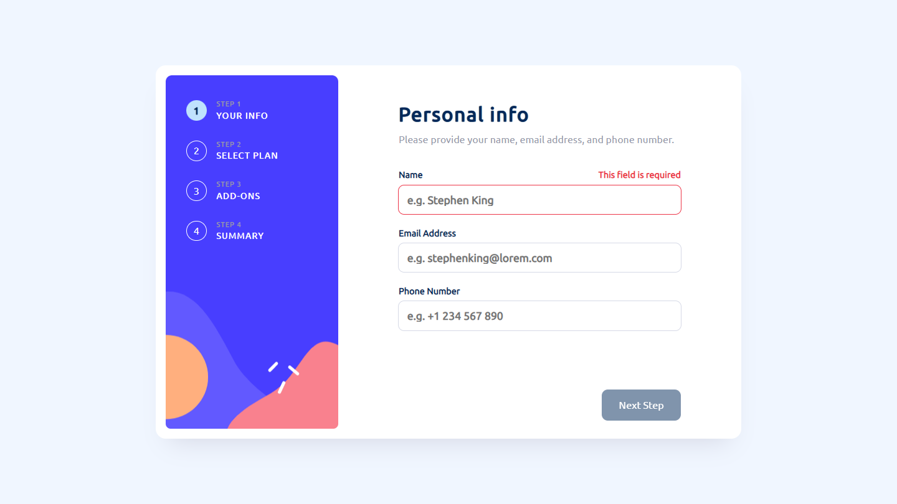
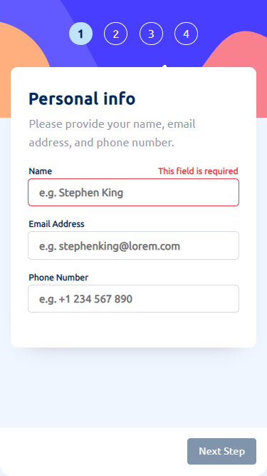

# Frontend Mentor - Multi step form

## Solution

  

## The challenge
Users should be able to:

- Complete each step of the sequence
- Go back to a previous step to update their selections
- See a summary of their selections on the final step and confirm their order
- View the optimal layout for the interface depending on their device's screen size
- See hover and focus states for all interactive elements on the page
- Receive form validation messages if:
  - A field has been missed
  - The email address is not formatted correctly

## Links
- Solution URL: [Add solution URL here](https://your-solution-url.com)
- Live Site URL: [Multi Step Form](https://multi-step-form-jec.vercel.app/)

## Built with
- JavaScript
- TypeScript
- [React](https://react.dev/)
- HTML
- CSS
- [Formik](https://formik.org/)
- [Yup](https://www.npmjs.com/package/yup)
- [Vite](https://vitejs.dev/)